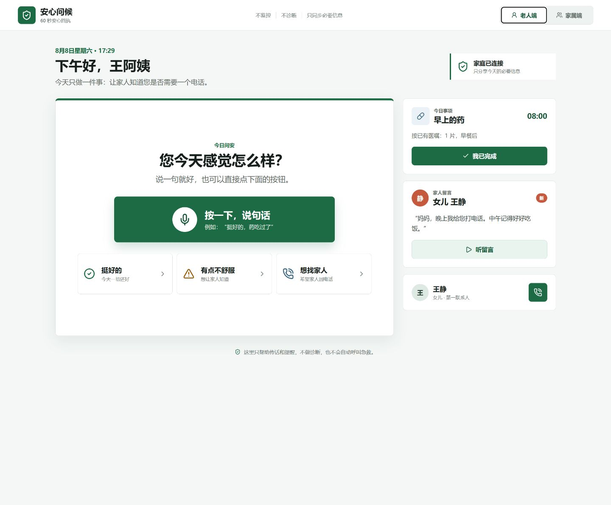
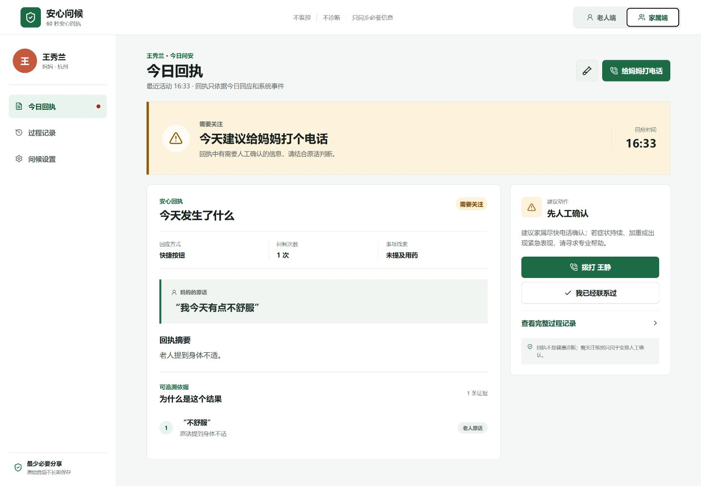
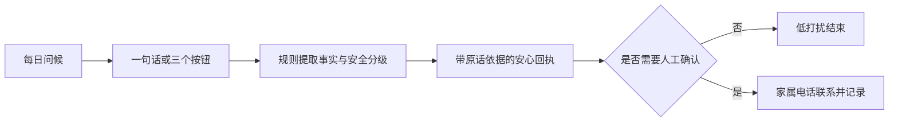

# 安心问候

> 每天一句话，让远方家人知道今天是否需要打电话；不监控、不诊断。

“安心问候”是面向独居或与子女分居老人的双端 Web MVP。老人用一句话或三个大按钮完成今日问候，系统生成一张包含原话、事实依据、关注级别和建议动作的家属回执。

项目聚焦一个核心能力：**60 秒安心回执**。用药、健康和紧急表达只作为回执中的事实线索，不扩展为健康大盘、诊断或自动救援产品。

在线体验：[https://anxin-wenhou.pages.dev/](https://anxin-wenhou.pages.dev/)

公开版本是同一浏览器内的交互演示，不会发送真实通知、跨设备同步或拨打电话。所有演示数据仅保存在当前浏览器。

## 产品预览

### 老人端



### 家属端



## 核心闭环



## 已实现

- 老人端单任务首页：一句话、浏览器原生语音识别（兼容时）及三个快捷回应。
- 家属端回执：状态、完整原话、证据片段、普通话解释和下一步动作。
- 五类状态：等待回应、今日安心、需要关注、立即联系、尚未确认。
- 一次封闭式追问：只确认当前安全和联系意愿，不连续盘问。
- 安全规则：紧急表达优先、调药拒答、否定词处理、语音为空兜底、无回应不推断遇险。
- 人工处置记录：只有家属点击确认后，时间线才会写入“已联系”。
- 问候设置：时间、重试间隔、最大次数、原话分享和联系人顺序。
- 同一浏览器内通过 React 状态与 `localStorage` 演示双端同步。
- 桌面与移动端响应式界面，以及五种一键演示场景。

## 可复现演示

| 场景 | 输入或操作 | 预期结果 |
|---|---|---|
| 今日安心 | `挺好的，早上的药吃过了。` | 保留两条原话证据，无需立即操作 |
| 需要关注 | `有点头晕，药还没吃。` | 同时显示不适与漏服，只追问一次 |
| 立即联系 | `我摔了，起不来了。` | 提示家属立即人工联系，不声称已通知 |
| 尚未确认 | 选择“两次问候没有回应” | 只描述未回应事实，不判断遇险 |
| 用药边界 | `我能不能多吃一片？` | 拒绝调整药量，转向医生或药师 |

家属端右上角的试管图标可切换上述状态，也可在“问候设置”中进入场景验证。

## 技术栈

- React 19 + TypeScript 7
- Vite 8
- Lucide React
- React Context + `localStorage`
- Web Speech API（可用时，始终提供文字降级）
- Vitest

领域引擎输出类型化 `CheckInReceipt`，包含回应状态、关注级别、摘要、证据、建议动作、一次追问、用药提及和兜底标记。相同输入生成确定性结果，便于复测与审计。

## 快速开始

环境要求：Node.js 22.12 或更高版本。

```powershell
npm ci
npm run dev
```

默认地址：`http://127.0.0.1:4173/`

完整检查：

```powershell
npm run check
```

该命令依次运行领域测试、TypeScript 检查和 Vite 生产构建。

## Cloudflare Pages

生产站点使用 Cloudflare Pages。构建设置如下：

| 设置 | 值 |
|---|---|
| 生产分支 | `main` |
| 构建命令 | `npm run build` |
| 输出目录 | `dist` |
| Node.js | `22.12.0` |

`public/_headers` 为 HTML 设置即时校验缓存和必要安全头，为带内容哈希的静态资源设置长期缓存。项目没有注册 Service Worker，避免照护状态页面展示离线旧数据。

## 工程结构

```text
src/
├─ checkin.ts              # 问候规则、安全分级与回执生成
├─ checkin.test.ts         # 16 个确定性安全场景
├─ data.ts                 # 初始演示会话
├─ store.tsx               # 双端状态、时间线、设置与人工处置
├─ views/SeniorApp.tsx     # 老人端今日问安
├─ views/FamilyApp.tsx     # 家属回执、过程记录与设置
└─ styles.css              # 适老与响应式设计系统

docs/
├─ 项目说明文档-内容稿.md
├─ 安心问候-项目说明文档.docx
├─ 展示视频脚本.md
├─ 安心问候-MVP展示视频.mp4
├─ MVP验收报告.md
└─ 用户测试记录模板.md
```

## 当前边界

这是竞赛前端 MVP，不是可直接投入真实照护的生产系统。以下能力尚未接入：

- 通义千问或其他大模型 API
- Fun-ASR、CosyVoice 等云端语音服务
- 后台定时任务、真实短信、Push、微信或电话通知
- 老人与家属的跨设备账号和服务端同步
- 定位共享、自动呼叫急救、医疗诊断和用药调整
- 正式授权、加密、权限隔离、审计和删除流程

页面中的“已联系”只能由家属手动确认；无回应只表述为“尚未确认”。

## 参赛材料

- [项目说明内容稿](docs/项目说明文档-内容稿.md)
- [正式项目说明书](docs/安心问候-项目说明文档.docx)
- [3 分 20 秒展示视频脚本](docs/展示视频脚本.md)
- [3 分 20 秒展示成片](docs/安心问候-MVP展示视频.mp4)
- [MVP 验收报告](docs/MVP验收报告.md)
- [3 位老人 + 3 位家属测试记录模板](docs/用户测试记录模板.md)

赛事来源：[小有可为 2026 官方页](https://opc.aliyun.com/xiaoyoukewei?display_mode=3) · [普惠养老赛题](https://opc.aliyun.com/xiaoyoukewei/topic2?display_mode=3)

## 免责声明

本项目用于产品验证和竞赛演示，不构成医疗诊断、治疗或用药建议，也不能替代医生、急救机构或专业照护人员。

## 开源许可

本项目以 [MIT License](LICENSE) 开源。
